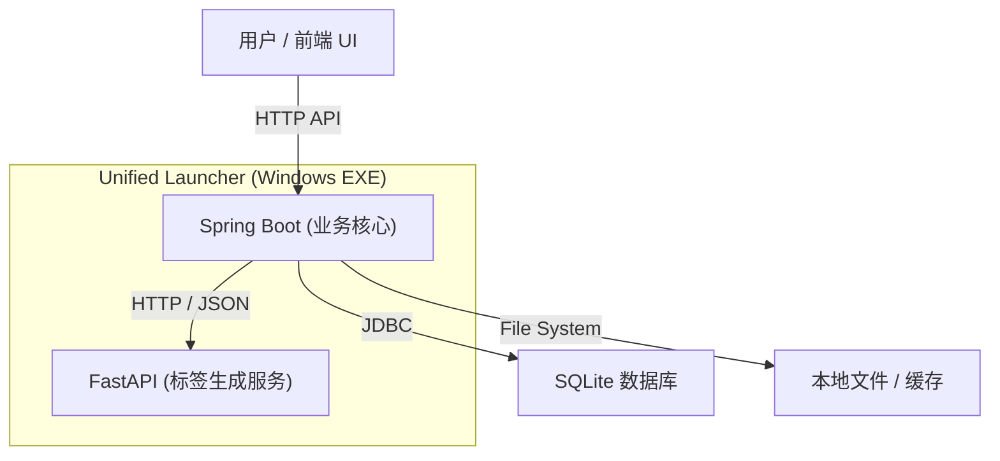

# BaKaBooru

> **给本地图片一个可搜索的语义层。**
> 
> *一款高性能、本地优先、AI 驱动的次世代图库与资产管理系统。*

**BaKaBooru** 旨在解决传统本地图片管理架构粗糙、体验不佳的问题。面对海量的插画、二次元图片或 AI 生成图，传统的“文件名管理法”已失效，而手动打标成本极高。

我们构建了一个多端协作的现代化平台，通过引入 AI 自动标签作为语义增强，核心目标是**解决大量图片在本地环境下的管理和检索问题**。

> ⚠️ **项目状态**: 目前处于 **MVP (最小可行性产品)** 阶段。核心能力已经完整，功能正在逐步扩展中，主要用于验证系统结构和 AI 能力的可行性。

## 💡 为什么开发这个项目？ (Pain Points)

现实中存在真实的痛点：
*   **数量爆炸**: 个人收藏的插画、AI 产图数量极大，难以整理。
*   **语义缺失**: “文件名 ≠ 图片内容”，检索基本靠记忆。
*   **标注困难**: 手动为每一张图片打标签是不可能完成的任务。
*   **隐私顾虑**: 本地图片体量大且涉及隐私，不方便上传至云端服务。
*   **工具匮乏**: 现有的本地管理软件几乎不具备 AI 语义理解能力。

**BaKaBooru 的核心价值**：本地图片不方便上云，那就把 AI 能力带到本地，让混乱的文件夹变成井井有条的语义数据库。

## 🏗️ 系统架构 (Architecture)

这也**不是一个单纯的后端项目**，而是一个基于 **多后端架构 + 统一交互界面** 的完整系统。各模块独立运行、独立打包，由 Launcher 统一调度：



*   **Spring Boot (Business Core)**: 负责业务逻辑、图片文件管理、元数据存储、前端 API 接口。
*   **FastAPI (AI Inference)**: 专注于运行深度学习模型，提供图像标签生成的推理服务。
*   **Frontend (Unified UI)**: 基于 Vue 3 的现代化 Web 界面，提供统一的交互体验。
*   **Launcher**: 使用 PyInstaller 打包的自定义启动器，将前后端服务封装为 Windows 可执行程序，实现一键启动。

两者通过标准 HTTP/JSON 协作，既保持了 Java 生态在业务治理上的优势，又利用了 Python 在 AI 领域的统治力。

## ✨ 核心特性

### 🤖 AI 智能标签与语义层
*   **自动识别**: 集成先进的深度学习视觉模型，图片上传时自动分析并生成精准标签 (Tag)。
*   **分类与整理**: 告别繁琐的手动工作，实现自动分类与语义索引。
*   **解耦设计**: 独立的推理服务设计，即使更换模型或升级 AI 引擎也不影响业务核心。

### 🖼️ 沉浸式浏览体验
*   **响应式瀑布流**: 自适应布局，从 4K 显示器到移动端设备均能完美展示。
*   **高性能渲染**: 虚拟滚动 (Virtual Scrolling) 技术支持数万张图片流畅滑动，告别卡顿。
*   **交互优化**: 提供类似原生相册的查看体验，支持元数据查看及快捷编辑。

### 💾 统一数据管理
*   **数据目录**: 设计了统一的数据目录结构，所有图片、数据库、缓存、模型权重均存储在 `data/` 下，便于迁移。
*   **缓存机制**: 针对 Windows 环境优化的临时文件与缩略图缓存清理机制。
*   **安全存储**: 元数据存入 SQLite，图片文件按 Hash 存储，兼顾性能与数据一致性。

### 📦 便捷部署
*   **一键启动**: 通过自定义 Launcher，无需用户手动配置 Java/Python 环境，双击即可运行（Release 版）。
*   **独立打包**: 前后端分离开发，但在发布时通过 PyInstaller 整合，降低用户使用门槛。

## 🛠️ 技术栈

*   **业务后端**: Java 21, Spring Boot 3, Spring Data JPA, SQLite
*   **AI 服务**: Python 3.10+, FastAPI, PyTorch/ONNX
*   **前端交互**: Vue 3, TypeScript, Naive UI, Tailwind CSS, Pinia
*   **部署构建**: PyInstaller, Maven, Vite

## 📦 开发与运行 (Dev Setup)

### 前置要求
*   **Java**: JDK 21+
*   **Node.js**: LTS (推荐 pnpm)
*   **Python**: 3.10+

### 1. 启动业务后端
```bash
cd backend
mvn spring-boot:run
# 服务运行在 http://localhost:8080
```

### 2. 启动前端界面
```bash
cd frontend
pnpm install && pnpm dev
# 页面运行在 http://localhost:5173
```

### 3. 启动 AI Tagger 服务
```bash
cd tagger
pip install -r requirements.txt
python run_app.py --data_dir ../data
# 服务运行在端口 8000 (默认由后端自动调用)
```

## 🗺️ 目录结构
```
BaKaBooru/
├── backend/     # Spring Boot - 业务核心、图片管理、API
├── frontend/    # Vue 3 - 用户界面
├── tagger/      # Python/FastAPI - AI 推理服务
├── launcher/    # Python - Windows 一键启动器逻辑
└── data/        # [Generated] 数据存储 (DB, Images, Models, Cache)
```

## 📄 许可证
本项目采用 MIT 许可证。

