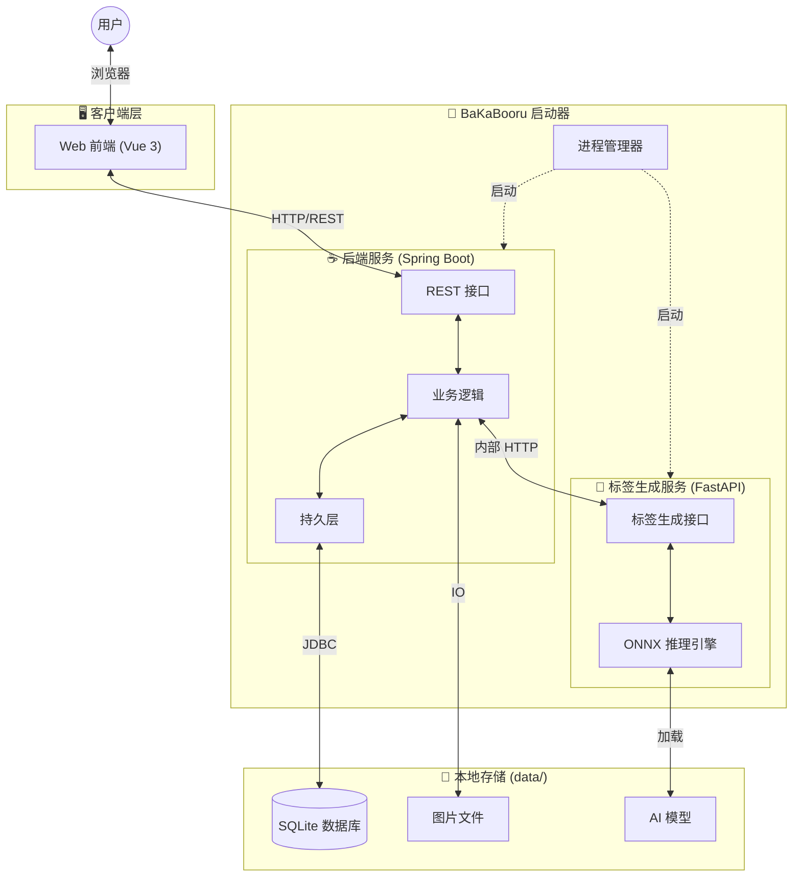

# BaKaBooru

**BaKaBooru** 是一款深度融合 **AI 视觉识别**与 **LLM 语义解析**的本地图片管理系统。它旨在解决海量非结构化图片（插画、设计稿、摄影作品、AI 生成图）的管理难题。通过内置的端侧推理引擎，BaKaBooru 能瞬间理解图片内容并将其转化为可检索、可管理的**智能语义资产**，让您杂乱的文件夹瞬间变身井井有条的个人灵感库。

---

## ✨ 核心特性

### 1. 全维度 AI 视觉识别 (On-Device Visual AI)
无需上传图片至云端，BaKaBooru 集成了先进的 **Camie Tagger V2** 视觉模型与 **ONNX Runtime**，利用本地 CPU 即可实现毫秒级推理。
*   **零感自动标注**: 文件上传即刻分析，生成包括内容描述、艺术风格在内的精准标签。
*   **智能语义分类**: 标签不再是一团乱麻。系统自动将其分门别类为：
    * **版权 (Copyright)**: 作品所属的 IP 或系列。
    * **角色 (Character)**: 画面中的人物角色。
    * **艺术家 (Artist)**: 画师或创作者标识。
    * **元数据 (Meta)**: 分辨率、宽高比等技术参数。
*   **安全编辑模式**: 提供“编辑模式”开关，浏览时锁定标签修改，有效防止误触；需要调整时一键开启，支持AI重生成、手动增删及多维分类管理。

### 2. LLM 意图解析系统 (Cloud-Native Semantic Parsing)
告别复杂的布尔逻辑和筛选表单。BaKaBooru 通过您配置的 **云端 LLM API** (支持 OpenAI, Claude 等)，让搜索这一行为回归直觉。
*   **自然语言即指令**: 您只需描述需求，例如：
    > *"帮我找一下4K分辨率的、蓝色眼睛的短发女孩插画，且文件要大于5MB，把查看次数最多的排在前面。"*
*   **结构化参数提取**: 系统会自动分析您的意图，提取出 `Tags: short_hair, 1girl, blue_eyes`, `Meta: 4k`, `Size: >5MB`, `Sort: View Count` 等参数，并自动填充到搜索器中，真正实现“所想即所得”。

### 3. 专家级画廊体验 (Pro Gallery)
专为大图库设计的交互系统，兼顾美观与效率。
*   **极致性能**: 采用虚拟滚动 (Virtual Scroll) 与响应式瀑布流技术，哪怕图库包含十万张图片，滚动浏览依然丝般顺滑。
*   **原生级交互**:
    *   **右键语境菜单**: 深度定制的右键菜单，提供下载、删除、重制标签、编辑元数据等一键直达操作。
    *   **视觉反馈**: 清晰的选中态高亮与动态遮罩，让每一次操作都心中有数。
*   **智能缓存**: 自动维护缩略图与临时文件生命周期，保持磁盘整洁有序。

### 4. 企业级安全与隐私 (Security & Privacy)
*   **数据主权**: 所有的图片源文件、数据库 (SQLite) 及 AI 模型权重均存储于本地 `data/` 目录。**零隐形上传**，您的资产完全属于您。
*   **资源验签 (Signed URL)**: 所有图片资源的访问链接均包含时效性数字签名，有效防止未授权访问与盗链，保护您的资源安全。
*   **严格鉴权**: 内置基于 JWT 的用户认证体系，确保只有您本人可以访问管理界面。

---

## 🏗️ 系统架构

BaKaBooru 采用自研 **Launcher** 统一调度的多进程微服务架构，完美融合了 Java 生态的工程稳健性与 Python 在 AI 领域的统治力。



---

## 🚀 快速开始

### 运行环境
*   **OS**: Windows 10/11 (x64)
*   **集成环境**: 发布包已内置运行时，无需用户预装 Java 或 Python。

### 立即启动
1.  双击运行根目录下的 `bakabooru.exe`。
2.  **自动初始化**: 首次运行将在同级目录自动创建 `data/` 文件夹结构。
3.  **访问**: 启动成功后，浏览器自动打开 `http://localhost:8080`。
    *(注: 请勿关闭弹出的命令行窗口，它是后台服务的宿主)*

## 📖 使用指南

### 🔍 混合搜索系统
*   **标签筛选 (Tag)**:
    *   **AND**: `blue_sky cloud` (同时包含)
    *   **NOT**: `-1girl` (排除)
    *   **自动联想**: 输入时实时匹配已有标签库。
*   **AI 智能解析**:
    *   点击搜索栏左侧的 ⚡ 闪电图标或使用快捷键，输入自然语言，调用配置好的 LLM API 自动生成搜索条件。
*   **关键词 (Keyword)**:
    *   对文件名、标题进行模糊匹配。

### ⚙️ 系统配置
进入 Web 端「设置」页面可调整核心行为：
*   **AI 识别设置**:
    *   **全局阈值 (Threshold)**: 默认 `0.6`。调低可增加召回率（标签更多但可能误识），调高则更精准。
    *   **分类阈值**: 可针对“角色”、“画师”等特定分类单独设定敏感度。
*   **LLM 设置**:
    *   在此处填入您的 LLM API Key 及 Endpoint Url (支持 OpenAI 格式) 以启用自然语言搜索。
*   **性能设置**: 调整上传并发数、缩略图生成质量等。

### 🔧 启动参数 (高级)
`bakabooru.exe` 支持灵活的命令行参数，满足端口冲突解决或特定网络环境部署的需求：

| 参数 | 默认值 | 说明 |
| :--- | :--- | :--- |
| `--web-host` | `0.0.0.0` | 业务后端/Web 服务监听地址 |
| `--web-port` | `8080` | 业务后端/Web 服务监听端口 |
| `--tagger-host` | `0.0.0.0` | AI 标签服务监听地址 |
| `--tagger-port` | `8081` | AI 标签服务监听端口 |

**使用示例**:
```bash
# 修改 Web 端口为 9090，标签服务端口为 9091
bakabooru.exe --web-port 9090 --tagger-port 9091
```

---

## 🛠️ 源码构建 (Dev)

若需进行二次开发或从源码编译：

1.  **后端**: `cd backend && mvn spring-boot:run` (需 JDK 21+)
2.  **前端**: `cd frontend && pnpm dev` (需 Node.js LTS)
3.  **AI 服务**: `cd tagger && python run_app.py --data_dir ../data` (需 Python 3.10+)

**一键打包**:
在根目录执行:
```bash
mvn clean install
```
产物将生成于根目录。

## 📄 开源协议
本项目采用 [MIT License](LICENSE) 宽松开源协议。

