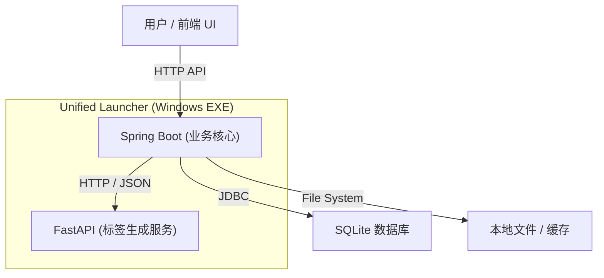

# BaKaBooru

> **给本地图片一个可搜索的语义层。**

**BaKaBooru** 是一个本地优先的现代化图片管理平台。它旨在解决海量本地图片（插画、AI 生图）管理难、检索难的问题。通过集成 AI 视觉模型，自动为图片建立语义标签，让混乱的文件夹变成井井有条的语义数据库。

> ⚠️ **项目状态**: MVP (最小可行性产品) 阶段。核心功能已就绪，持续迭代中。

## ✨ 核心特性

### 🤖 强大的标签系统
*   **AI 自动标注**: 集成深度学习视觉模型，上传即自动生成精准标签 (Tag)。
*   **标签管理**: 支持重新生成标签、添加自定义标签（支持多种类型），具备完善的标签增删改查功能。
*   **多维分类**: 标签自动归类显示（版权、角色、作者、自定义、元数据等），支持颜色区分，直观清晰。
*   **安全编辑**: 需开启编辑模式（铅笔图标）才可删除标签，有效防止误操作。

### 🖼️ 现代化的图库管理
*   **沉浸式浏览**: 响应式瀑布流布局，结合虚拟滚动技术，支持数万张图片流畅预览与滑动。
*   **高效交互**:
    *   **右键菜单**: 定制化的图片右键菜单，提供查看详情、选中、下载、删除等快捷操作。
    *   **选中模式**: 支持长按快速选中、多选、一键全选/取消全选。
    *   **批量操作**: 支持选定图片后的批量打包下载 (ZIP) 和批量删除。
    *   **视觉反馈**: 选中状态下拥有清晰的边框高亮、打钩图标和遮罩效果。
*   **体验优化**: 全局禁用浏览器默认右键菜单和图片拖拽，带来类似原生应用的操作体验。

### 🏗️ 稳健的系统架构
采用 **多后端架构 + 统一交互界面**，由 Launcher 统一调度：



*   **Spring Boot**: 承载核心业务逻辑、文件管理与 API 接口。
*   **FastAPI**: 专注于 AI 模型推理，提供高性能的标签生成服务。
*   **Vue 3 Frontend**: 基于 Naive UI 打造的现代化 Web 界面。
*   **Unified Launcher**: 将多服务封装为 Windows 可执行程序，实现一键启动。

### 💾 数据自主
*   **本地存储**: 所有图片、数据库、模型权重均存储在本地 `data/` 目录，隐私安全，易于迁移。
*   **智能缓存**: 自动管理的临时文件与缩略图缓存机制，保持系统轻量。

## 🛠️ 技术栈

*   **业务后端**: Java 21, Spring Boot 3, Spring Data JPA, SQLite
*   **AI 服务**: Python 3.10+, FastAPI, ONNX Runtime
*   **前端交互**: Vue 3, TypeScript, Naive UI, Tailwind CSS, TanStack Query
*   **部署构建**: PyInstaller, Maven, Vite

## 📦 快速开始 (Dev)

### 前置要求
*   **Java**: JDK 21+
*   **Node.js**: LTS (推荐 pnpm)
*   **Python**: 3.10+

### 运行步骤

1.  **启动业务后端**:
    ```bash
    cd backend
    mvn spring-boot:run
    ```

2.  **启动前端界面**:
    ```bash
    cd frontend
    pnpm install && pnpm dev
    ```

3.  **启动 AI Tagger 服务**:
    ```bash
    cd tagger
    pip install -r requirements.txt
    python run_app.py --data_dir ../data
    ```

访问前端页面: `http://localhost:5173`

## 🗺️ 目录结构
```
BaKaBooru/
├── backend/     # Spring Boot - 业务核心
├── frontend/    # Vue 3 - 用户界面
├── tagger/      # Python/FastAPI - AI 推理服务
├── launcher/    # Python - Windows 一键启动器逻辑
└── data/        # [自动生成] 数据存储 (DB, Images, Models, Cache)
```

## 📄 许可证
本项目采用 MIT 许可证。

