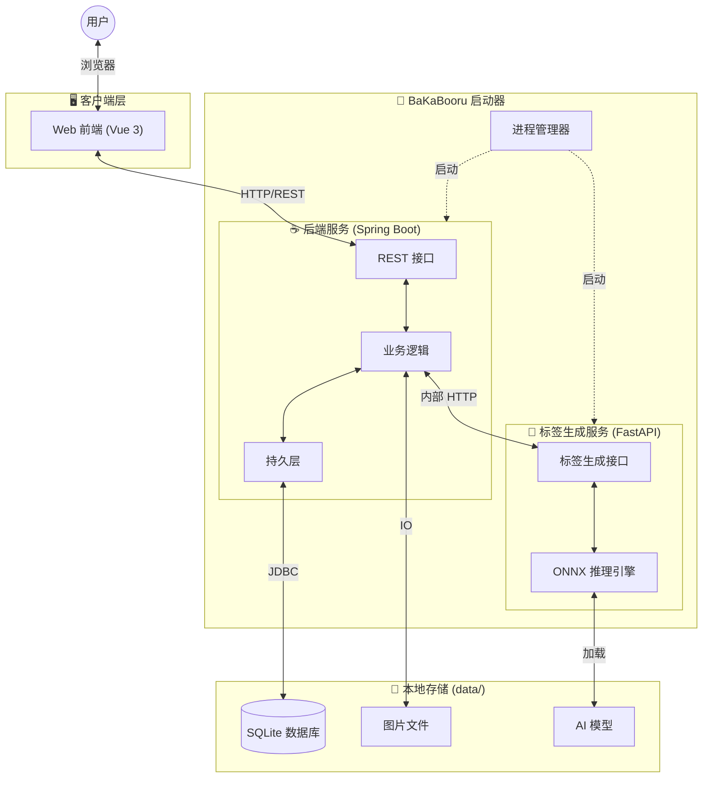

# BaKaBooru

**BaKaBooru** 是一款**本地优先 (Local-First)** 的现代化智能图片管理平台。它专为解决海量本地图片（插画、AI 生图、摄影作品）的管理与检索难题而生。通过内置的前沿 AI 视觉模型，BaKaBooru 能自动理解图片内容并生成语义标签，将您混乱的文件夹瞬间转化为井井有条的**智能语义数据库**。

## ✨ 核心特性

### 🤖 AI 驱动的智能标签系统
*   **零感自动标注**: 集成先进的深度学习视觉模型（基于 [Camie Tagger V2](https://huggingface.co/spaces/Camais03/camie-tagger-v2-app)），文件上传瞬间即可自动分析并生成精准的语义标签 (Tag)。
*   **全生命周期管理**: 支持标签的重生成、自定义添加及多维分类。
*   **智能分类引擎**: 自动将标签归类为版权 (Copyright)、角色 (Character)、创作者 (Artist)、元数据 (Meta) 等维度，并以不同色彩直观呈现。
*   **防误触机制**: 引入"编辑模式"安全锁，有效防止日常浏览时的误操作。

### 🧠 LLM 智能语义解析（新 ✨）
*   **自然语言即配置**: 厌倦了繁琐的表单筛选？现在，您只需用自然语言描述需求（例如："帮我找几张4K分辨率的、蓝色眼睛的二次元女孩，文件要大于5MB"）。
*   **智能参数填充**: 内置的大语言模型服务将自动分析您的意图，精准提取**关键词**、**标签**、**分辨率范围**、**文件大小限制**等参数，并自动填写到高级搜索表单中。您只需确认即可一键直达，真正实现"所想即所得"。

### 🖼️ 沉浸式画廊体验
*   **极致性能**: 采用响应式瀑布流布局与虚拟滚动技术 (Virtual Scroll)，轻松驾驭数万张图片，纵享丝般顺滑的浏览体验。
*   **原生级交互**:
    *   **上下文菜单**: 深度定制的右键菜单，提供查看、下载、删除等一键直达操作。
    *   **高效多选**: 支持 Shift 长按连选、拖拽框选等快捷手势。
    *   **批量处理**: 提供一键打包下载 (ZIP) 与批量删除功能，大幅提升整理效率。
    *   **视觉反馈**: 选中态的高亮边框与动态遮罩，让每一次操作都清晰可见。
*   **纯净模式**: 全局屏蔽浏览器默认行为，带来媲美原生桌面应用的沉浸感。

### 🏗️ 企业级稳健架构

BaKaBooru 采用**多进程微服务架构**，通过自研的 Launcher 统一调度。这种设计完美融合了 Java生态的工程稳健性与 Python 在 AI 领域的统治力。



*   **Launcher (智能启动器)**: 基于 Python 开发的轻量级进程编排器，负责子服务的一键启停与日志聚合。
*   **Backend (核心中台)**: 
    *   **Spring Boot**: 承载核心业务逻辑、元数据治理及 RESTful API 网关。
    *   **SQLite**: 嵌入式零配置数据库，高效存储海量元数据与关联关系。
*   **AI Service (神经网络引擎)**:
    *   **FastAPI**: 提供高性能的模型推理微服务接口。
    *   **ONNX Runtime**: 采用量化模型技术，在 CPU 环境下即可实现毫秒级的本地标签推理，无需昂贵的显卡硬件支持。
*   **Frontend (交互层)**:
    *   **Vue 3 + Naive UI**: 打造响应式 SPA 单页应用，交互流畅自然。
    *   **性能调优**: 针对大列表渲染进行深度优化，确保海量数据下的操作跟手性。

### 🔒 安全防护与隐私自主
*   **严密的访问控制**:
    *   **JWT 鉴权**: 内置基于 JWT 的登录认证系统，可设置密码，确保仅您本人可访问。
    *   **资源验签 (Signed URL)**: 所有图片资源的访问链接均包含时效性数字签名，有效防止未授权访问与盗链。
*   **完全本地化**: 所有的图片文件、数据库、AI 模型权重均存储于本地 `data/` 目录，您的数据完全属于您自己。
*   **零云端依赖**: 无需联网即可完整运行核心功能，彻底杜绝隐私泄露风险。
*   **智能缓存**: 自动维护临时文件与缩略图生命周期，保持磁盘整洁。

## 🛠️ 技术栈一览

*   **业务后端**: Java 21, Spring Boot 3, Spring Data JPA, SQLite
*   **AI 服务**: Python 3.10+, FastAPI, ONNX Runtime
*   **前端交互**: Vue 3, TypeScript, Naive UI, Tailwind CSS, TanStack Query
*   **构建部署**: PyInstaller, Launch4j, Maven, Vite

## 🚀 快速开始

### 环境准备
✅ **零环境依赖**。
得益于内置的独立运行时（Embedded JRE & Python Runtime），BaKaBooru 实现了真正的 "开箱即用"。您无需繁琐地安装 Java 或 Python 环境。

### 启动应用
1.  双击运行根目录下的 `bakabooru.exe`。
2.  **自动初始化**: 首次运行将在同级目录自动创建 `data/` 文件夹，用于存放数据库、图库及 AI 模型。
3.  **开始体验**: 启动成功后，浏览器自动访问 `http://localhost:8080` (端口可配置)。
4.  **温馨提示**: 这是一个控制台程序，它会在后台守护 Java 与 Python 服务，请勿关闭弹出的命令行窗口（若有）。

### 🔧 高级配置 (命令行参数)
`bakabooru.exe` 支持灵活的命令行参数，满足端口冲突解决或特定网络环境部署的需求：

| 参数 | 默认值 | 说明 |
| :--- | :--- | :--- |
| `--web-host` | `0.0.0.0` | 业务后端/Web 服务监听地址 |
| `--web-port` | `8080` | 业务后端/Web 服务监听端口 |
| `--tagger-host` | `0.0.0.0` | AI 标签服务监听地址 |
| `--tagger-port` | `8081` | AI 标签服务监听端口 |

**使用示例**:
```bash
# 将 Web 服务端口修改为 9090
bakabooru.exe --web-port 9090
```

## 📖 使用手册

### 🔍 搜索语法
BaKaBooru 提供了强大的混合搜索功能，助您快速定位目标：

*   **标签筛选 (Tag Filter)**
    *   **AND 搜索**: 输入多个标签（空格分隔），例如 `blue_sky cloud`，查找同时包含蓝天和云的图片。
    *   **排除搜索**: 使用 `-` 前缀，例如 `-1girl`，排除包含该标签的图片。
    *   **自动联想**: 输入时会自动匹配已有标签库。

*   **✨ 智能解析 (Smart Parsing)**
    *   在左侧边栏顶部，您会看到全新的**智能解析输入框**。
    *   输入任意自然语言描述，按 `Ctrl + Enter` 或点击闪电图标按钮，AI 将自动为您配置好下方的所有搜索条件。

*   **关键词检索 (Keyword)**
    *   在关键词输入框中输入文本，将自动模糊匹配图片的**文件名**与**标题**。

### 🖼️ 画廊交互
*   **高效多选**:
    *   `Click`: 选中/取消选中单张。
    *   `Shift + Click`: 选中上一次点击与当前点击之间的所有图片（范围选择）。
    *   `Ctrl + Click`: 用于追加选中。
*   **快捷操作**: 选中状态下按 `Delete` 键可删除图片。
*   **右键菜单**: 在任意图片上右击，可呼出上下文菜单进行下载、重制标签等操作。

## ⚙️ 配置指南

### 🖥️ 启动参数 (CLI)
若需修改端口或绑定地址，可在启动时附加参数：

| 参数 | 默认值 | 说明 |
| :--- | :--- | :--- |
| `--web-host` | `0.0.0.0` | Web 服务监听地址 (0.0.0.0 允许局域网访问) |
| `--web-port` | `8080` | Web 服务端口 |
| `--tagger-host` | `0.0.0.0` | AI 标签服务监听地址 (通常仅供本地后台调用) |
| `--tagger-port` | `8081` | AI 标签服务端口 |

### 🛠️ 系统设置 (Web)
进入 Web 端「设置」页面，可实时调整核心参数（变更即时生效）：

*   **上传设置**:
    *   **并发数**: 调整同时处理的任务数量，建议根据 CPU 核心数适度调整。
*   **AI 识别设置**:
    *   **阈值 (Threshold)**: 默认 `0.6`。降低此值会让 AI 产出更多标签（可能包含误识），提高此值则更精准但标签更少。
    *   **分类阈值**: 可针对不同分类（如角色、画师）单独设定敏感度。
*   **缩略图**: 调整画廊浏览时的缩略图质量与尺寸。

### 📂 数据目录结构
您的所有数据均存储在程序根目录下的 `data/` 文件夹中。**备份时仅需拷贝此文件夹**。

*   `data/db/`: 存放 `data.sqlite` 数据库文件（元数据核心）。
*   `data/image/`: 存放所有原始图片文件（按哈希重命名）。
*   `data/model/`: 存放自动下载的 AI 模型文件。
*   `data/temp/`: 存放缩略图缓存及临时文件（可安全清理）。

## 📦 源码构建

### 编译环境要求
若需从源码全量编译，请确保开发环境已就绪：
*   **Java**: JDK 21+
*   **Python**: 3.12+
*   **Node.js**: LTS 版本
*   **Maven**: 3.9+

### 一键编译
在项目根目录下执行 Maven 指令，自动化完成前端构建、后端打包及 EXE 生成：

```bash
mvn clean install
```

构建产物 `bakabooru.exe` 将生成在项目根目录。


## 🛠️ 开发者指南 (Dev)

模块化开发调试指引：

1.  **启动后端 (Backend)**:
    ```bash
    cd backend
    mvn spring-boot:run
    ```

2.  **启动前端 (Frontend)**:
    ```bash
    cd frontend
    pnpm install && pnpm dev
    ```

3.  **启动标签服务 (Tagger)**:
    ```bash
    cd tagger
    pip install -r requirements.txt
    python run_app.py --data_dir ../data
    ```

## 📄 开源协议
本项目采用 [MIT License](LICENSE) 宽松开源协议。
