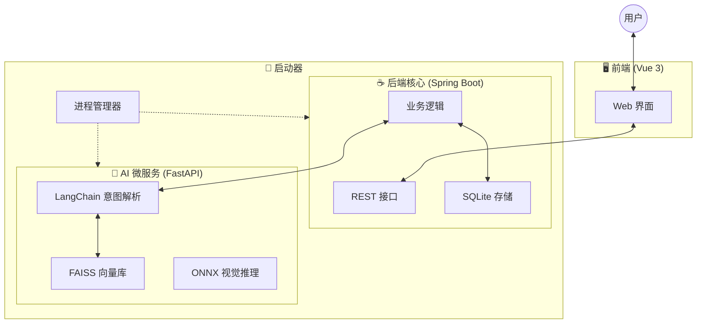

# BaKaBooru: 本地优先的 AI 智能图片管理平台

    

**BaKaBooru** 是一款结合了 **LLM（大语言模型）** 和 **计算机视觉** 技术的现代化图片管理系统。

**什么是“本地优先 (Local-First)”？**
简单来说，就是**“你的数据完全属于你，且不依赖网络”**。
不同于 Google Photos 或 iCloud，BaKaBooru 的所有 AI 运算（图片识别、语义搜索）都在你的电脑本地完成。这意味着：
1.  **零隐私泄露**：照片不用上传云端。
2.  **极速响应**：没有网络延迟，像打开本地文件夹一样快。
3.  **永久可用**：即使断网，所有功能（包括 AI 搜索）依然可用。

> **👨‍💻 开发者笔记 (Dev Note)**:
> 本项目是我探索 **AI Native（AI 原生）应用** 的实践作品。我试图解决传统图库“只能按文件名搜索”的痛点，通过 **RAG (检索增强生成)** 架构，让机器真正“读懂”用户的自然语言需求。

---

## 🧠 AI 核心技术实现 (Technical Highlights)

> *这部分展示了项目如何利用 LangChain 和向量数据库解决实际问题，是本项目的技术核心。*

### 1. 基于 LangChain 的智能意图解析 (RAG & Prompt Engineering)
用户通常习惯说“找几张蓝色档案爱丽丝的图”，而不是输入复杂的布尔查询语句。为了解决这个问题，我构建了一套 **意图解析流水线**：

* **结构化输出 (Structured Output)**: 使用 LangChain 的 `JsonOutputParser` 和 Pydantic 模型，强制 LLM 输出计算机可读的 JSON 格式，而不是随意的对话。
* **正负向标签自动分类**: 通过精心设计的 Prompt，系统能自动区分用户的“想要”和“不想要”。
    * *代码逻辑示例*:
        ```python
        class ParsedTags(BaseModel):
            positive: list[str] = Field(description="用户明确想要的元素")
            negative: list[str] = Field(description="用户明确排除的元素，如'不要戴眼镜'")
        ```
* **领域知识库挂载**: 针对二次元插画领域（如 Danbooru 标签体系），系统能将“各种别名”自动映射为“标准标签”。

### 2. 向量检索与语义对齐 (FAISS & Embeddings)
为了让 AI 懂行话（例如：输入 "Bunny Girl" 能搜到 `rabbit_ears`），我引入了向量搜索技术：

* **FAISS 向量库**: 我使用 FAISS 构建了一个本地的高性能向量索引。
* **Embedding 匹配**: 系统会将用户的自然语言查询转化为向量 (Vector)，然后在数万个标准标签中计算余弦相似度，找出最匹配的标签。这解决了传统关键词匹配无法处理同义词的问题。

### 3. 端侧视觉推理 (On-Device Inference)
* **本地模型部署**: 集成了 **Camie Tagger V2** 模型，通过 **ONNX Runtime** 在本地 CPU/GPU 上运行。
* **自动化工程**: 使用 Python 脚本自动处理模型下载 (`hf_hub_download`) 和版本管理，确保开箱即用。

---

## ✨ 核心功能特性

### 1. 全维度 AI 视觉识别
**无需动手，自动整理。**
只要把图片丢进去，系统就会立刻分析并打上标签。
* **自动分类**: 自动识别图片中的 **角色 (Character)**、**作品 (Copyright)** 和 **画师 (Artist)**。
* **智能参数**: 自动提取分辨率、宽高比等信息。
* **安全编辑**: 提供“编辑模式”开关，防止浏览时误触修改标签。

### 2. “说人话”的搜索体验
**告别复杂的筛选框，直接告诉它你想要什么。**
* **自然语言搜索**: 点击搜索栏的 ⚡ 图标，输入：
  > *"帮我找一下4K分辨率的、蓝色眼睛的短发女孩插画，不要戴眼镜。"*
* **所见即所得**: 系统会自动提取出 `Tags: short_hair, 1girl, blue_eyes`, `Negative: glasses`, `Meta: 4k` 并执行搜索。

### 3. 专家级画廊体验
* **丝滑浏览**: 采用了 **虚拟滚动 (Virtual Scroll)** 技术，哪怕文件夹里有 10 万张图，滚动起来也像只有 10 张一样流畅。
* **右键菜单**: 像操作系统一样好用的右键菜单，支持下载、删除、重新生成标签等操作。

### 4. 企业级安全与隐私
* **数据主权**: 所有数据库 (SQLite) 和文件都在本地 `data/` 目录下。
* **防盗链**: 图片链接带有数字签名，防止被其他程序非法读取。

---

## 🏗️ 系统架构

BaKaBooru 采用 **Java + Python 双进程架构**，结合了 Java 的工程稳定性与 Python 的 AI 生态优势。



---

## 🚀 快速开始 (用户篇)

### 运行环境
* **操作系统**: Windows 10/11 (x64)
* **环境依赖**: 发布包已内置运行环境，**你不需要手动安装 Java 或 Python**。

### 立即启动
1.  双击运行根目录下的 `bakabooru.exe`。
2.  **自动初始化**: 首次运行时，程序会自动创建 `data/` 文件夹。
3.  **访问**: 启动成功后，浏览器会自动打开 `http://localhost:8080`。
    *(注: 请保留黑色的命令行窗口，它是后台服务的“家”)*

### 🔧 启动参数 (高级设置)
如果你需要修改端口（比如端口被占用），或者在服务器上部署，可以使用以下命令行参数：

| 参数           | 默认值 | 说明 |
|:-------------| :--- | :--- |
| `--web-host` | `0.0.0.0` | 网站服务监听地址 |
| `--web-port` | `8080` | 网站访问端口 |
| `--ai-host`  | `0.0.0.0` | 内部 AI 服务地址 |
| `--ai-port`  | `8081` | 内部 AI 服务端口 |

**使用示例**:
```bash
# 将网站端口改为 9090，AI 服务端口改为 9091
bakabooru.exe --web-port 9090 --ai-port 9091
```

---

## 🛠️ 源码构建 (开发者篇)

如果你是开发者，想要修改源码或重新编译，请参考以下步骤：

### 1. 环境准备
* **Java**: JDK 21+
* **Node.js**: LTS 版本 (用于前端)
* **Python**: 3.10+ (用于 AI 服务)

### 2. 各模块运行指南

* **后端 (Spring Boot)**:
    ```bash
    cd backend
    mvn spring-boot:run
    ```
* **前端 (Vue 3)**:
    ```bash
    cd frontend
    pnpm install && pnpm dev
    ```
* **AI 服务 (Python)**:
    ```bash
    cd tagger
    # 安装依赖
    pip install -r requirements.txt
    # 启动服务 (会自动下载 FAISS 索引和 ONNX 模型)
    python run_app.py --data_dir ../data
    ```

### 3. 一键打包 (Build)
在项目根目录下执行以下 Maven 指令，即可生成最终的发布包：

```bash
mvn clean install
```
构建产物将生成在根目录的 `target/` 或 `dist/` 文件夹中。

---

## 📄 开源协议
本项目采用 [MIT License](LICENSE) 宽松开源协议。这意味着你可以免费使用、修改和分发本软件。